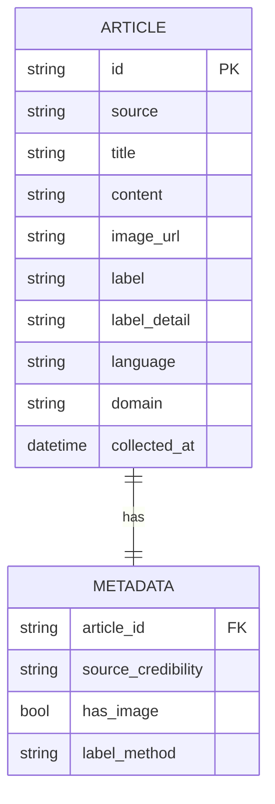

# 🕵️ CheckIt.AI — Pipeline ETL Fake News Detection

> **Rôle :** Ingénieur Data Junior @ CheckIt.AI  
> **Objectif :** Construire un pipeline ETL automatisé pour extraire, transformer et charger des données multimodales (texte + image) destinées à entraîner un modèle de détection de fake news.  
> **Stack :** Python · Apache Airflow · PostgreSQL · Docker

---

## 🎯 Contexte du projet

CheckIt.AI développe des outils d'intelligence artificielle pour lutter contre la désinformation. Pour alimenter son moteur d'analyse, la start-up a besoin d'un **pipeline d'acquisition de données multimodales** — des publications contenant à la fois du texte et des images.

La mission couvre l'intégralité du cycle data engineering :

```
Sources externes
  (APIs, datasets, RSS)
        │
        ▼
  ┌─────────────┐
  │  EXTRACT    │  ← Scripts d'extraction modulaires
  └──────┬──────┘
         │ données brutes (.jsonl)
         ▼
  ┌─────────────┐
  │  TRANSFORM  │  ← Nettoyage, normalisation, validation
  └──────┬──────┘
         │ données propres
         ▼
  ┌─────────────┐
  │    LOAD     │  ← Stockage SQL/NoSQL
  └──────┬──────┘
         │
         ▼
  ┌─────────────┐
  │  ORCHESTRATE│  ← DAG Airflow (automatisation)
  └──────┬──────┘
         │
         ▼
  ┌─────────────┐
  │   MONITOR   │  ← KPIs, alertes, tableau de bord
  └─────────────┘
```

---

## 📁 Structure du projet

```
checkit-pipeline/
│
├── dags/
│   └── fake_news_pipeline.py        ← DAG Airflow principal (Étape 4)
│
├── src/
│   ├── extraction/
│   │   ├── __init__.py
│   │   ├── newsdata_extractor.py    ← API NewsData.io (temps réel)
│   │   ├── fakeddit_extractor.py    ← Dataset statique FAKEDDIT
│   │   └── snopes_extractor.py      ← RSS + scraping Snopes
│   │
│   ├── transformation/
│   │   ├── __init__.py
│   │   ├── cleaner.py               ← Suppression doublons, nulls
│   │   ├── normalizer.py            ← Normalisation des champs
│   │   └── validator.py             ← Vérification texte + image présents
│   │
│   └── utils/
│       ├── __init__.py
│       ├── logger.py                ← Logging centralisé
│       └── config.py                ← Chargement .env
│
├── data/
│   ├── raw/                         ← Données brutes extraites (.jsonl)
│   └── processed/                   ← Données nettoyées prêtes pour le ML
│
├── notebooks/                       ← Exploration et prototypage
├── tests/                           ← Tests unitaires
├── docs/                            ← Livrables (rapports, schémas)
│
├── .env                             ← Clés API (non versionné)
├── .env.example                     ← Template des variables d'env
├── .gitignore
├── requirements.txt
└── README.md
```

---

## 🗂️ Sources de données

| Source | Modalités | Labels | Qualité | Volume | Usage |
|---|---|---|---|---|---|
| [FAKEDDIT](https://github.com/entitize/Fakeddit) | Texte + Image | 6 classes | ⭐⭐⭐⭐ | ~1M | Entraînement principal |
| [FakeNewsNet](https://github.com/KaiDMML/FakeNewsNet) | Texte + Image | Binaire | ⭐⭐⭐⭐⭐ | ~23K | Entraînement haute qualité |
| [NewsCLIPpings](https://github.com/g-luo/news_clippings) | Texte + Image | Binaire | ⭐⭐⭐⭐ | ~71K | Composante vision |
| [NewsData.io](https://newsdata.io) | Texte + Image | ❌ | N/A | ~200/j | Données fraîches (prod) |
| [LIAR Dataset](https://huggingface.co/datasets/liar) | Texte seul | 6 niveaux | ⭐⭐⭐⭐⭐ | ~12K | NLP / labels fins |
| [Snopes RSS](https://www.snopes.com/feed/) | Texte + Image | Nuancés | ⭐⭐⭐⭐⭐ | ~20/sem | Enrichissement continu |

### Schéma de sortie unifié

Toutes les sources sont normalisées dans ce format :

```json
{
  "id": "uuid-v4",
  "source": "fakeddit | fakenenewsnet | snopes | newsdata | ...",
  "title": "Article or post title",
  "content": "Full text content",
  "image_url": "https://...",
  "label": "fake | real",
  "label_detail": "false | misleading | satire | ...",
  "language": "en",
  "domain": "snopes.com",
  "collected_at": "2026-05-15T00:00:00Z",
  "metadata": {
    "source_credibility": "high | medium | low",
    "has_image": true,
    "label_method": "human_expert | community | automated"
  }
}
```

**Format de stockage :** `.jsonl` (JSON Lines) — un objet JSON par ligne, compatible Airflow et HuggingFace.

---

## 🗺️ Étapes & Livrables

### ✅ Étape 1 — Exploration des sources
> Identifier les sources multimodales pertinentes, évaluer leur qualité, proposer une méthode d'extraction.

**Livrable :** `docs/rapport_sources.md`

**Critères d'évaluation de chaque source :**
- Modalités (texte / image / les deux)
- Format (CSV, JSON, API, HTML)
- Langue et volume
- Qualité des labels (humain expert → automatique)
- Méthode d'extraction proposée
- Droits d'usage

---

### 🔲 Étape 2 — Scripts d'extraction
> Créer des scripts Python modulaires pour extraire des données multimodales depuis les sources sélectionnées.

**Livrables :** `src/extraction/*.py`

**Exigences techniques :**
- Structure en fonctions : `connect()`, `fetch()`, `parse()`, `save()`
- Gestion des erreurs avec `try/except` sur chaque appel réseau
- Logs à chaque étape (`logging` Python)
- Paramètres configurables via `.env` (clés API, chemins, limites)
- Sauvegarde en `.jsonl` dans `data/raw/`

**Sources prioritaires :**
- `newsdata_extractor.py` → API REST NewsData.io (articles + images en temps réel)
- `fakeddit_extractor.py` → Téléchargement TSV + récupération images via API Reddit (PRAW)
- `snopes_extractor.py` → Flux RSS `feedparser` + scraping BeautifulSoup

**Points de vigilance :**
- Respecter les quotas d'API (200 req/jour sur le plan gratuit NewsData.io)
- Vérifier `robots.txt` avant tout scraping
- Valider que chaque entrée possède bien un champ `image_url` non-nul

---

### 🔲 Étape 3 — Pipeline de transformation + schéma
> Transformer les données brutes en un format exploitable pour le ML. Documenter la structure avec un schéma conceptuel.

**Livrables :**
- `src/transformation/*.py` — pipeline de transformation reproductible
- `docs/schema_donnees.md` (ou `.mermaid`) — modèle conceptuel des données

**Étapes du pipeline de transformation :**

```
data/raw/*.jsonl
      │
      ▼
  cleaner.py
  ├── Suppression des doublons (sur id ou title)
  ├── Suppression des entrées sans texte ou sans image_url
  └── Nettoyage des caractères spéciaux, HTML résiduel
      │
      ▼
  normalizer.py
  ├── Normalisation des labels (→ "fake" | "real")
  ├── Format ISO 8601 pour collected_at
  ├── Lowercase + strip sur title et content
  └── Ajout du champ has_image (bool)
      │
      ▼
  validator.py
  ├── Vérification de la présence des champs obligatoires
  ├── Vérification que image_url est une URL valide
  └── Log des entrées rejetées avec motif
      │
      ▼
data/processed/*.jsonl
```

**Fonctions clés à implémenter :**
```python
def clean_text(text: str) -> str        # Nettoyage du contenu textuel
def normalize_label(label: str) -> str  # Mapping des labels vers fake|real
def validate_entry(entry: dict) -> bool # Vérifie les champs obligatoires
def is_valid_url(url: str) -> bool      # Vérifie le format de l'image_url
```

**Schéma conceptuel Mermaid :**


---

### 🔲 Étape 4 — DAG Airflow (orchestration ETL)
> Intégrer les scripts dans un DAG Airflow pour automatiser le pipeline de bout en bout.

**Livrable :** `dags/fake_news_pipeline.py`

**Architecture du DAG :**

```
[extract_newsdata] ──┐
                      ├──► [transform_clean] ──► [transform_normalize] ──► [load_to_db]
[extract_fakeddit] ──┘
```

**Tâches du DAG :**

```python
@dag(
    dag_id="fake_news_pipeline",
    schedule="0 6 * * *",    # Tous les jours à 6h du matin
    catchup=False,
)
def FakeNewsPipeline():
    extract_newsdata()        # PythonOperator → newsdata_extractor.py
    extract_fakeddit()        # PythonOperator → fakeddit_extractor.py
    transform_clean()         # PythonOperator → cleaner.py
    transform_normalize()     # PythonOperator → normalizer.py
    load_to_db()              # PythonOperator → INSERT dans PostgreSQL
```

**Dépendances :**
```python
[extract_newsdata, extract_fakeddit] >> transform_clean >> transform_normalize >> load_to_db
```

**Exigences :**
- Chaque tâche est un `PythonOperator` qui appelle une fonction de `src/`
- Connexion base de données configurée dans Airflow UI (Admin > Connections)
- Logs visibles dans l'interface Airflow par tâche
- DAG exécutable en local avec Docker Compose

**Prérequis :** environnement Airflow Docker fonctionnel (voir `docs/airflow_setup.md`)

---

### 🔲 Étape 5 — KPIs & Monitoring
> Définir des indicateurs de performance, créer un tableau de bord de suivi et un plan de monitoring production.

**Livrables :**
- `notebooks/dashboard_kpi.ipynb` (ou script Streamlit)
- `docs/plan_monitoring.md`

**KPIs à mesurer :**

| Indicateur | Description | Seuil d'alerte |
|---|---|---|
| `valid_rate` | % d'entrées valides après transformation | < 80% |
| `image_coverage` | % d'entrées avec image_url non-nulle | < 70% |
| `extract_duration` | Temps d'exécution de l'extraction (s) | > 120s |
| `transform_duration` | Temps d'exécution de la transformation (s) | > 60s |
| `records_per_run` | Nombre d'entrées chargées par run | < 10 |
| `label_balance` | Ratio fake/real dans le dataset | < 0.3 ou > 0.7 |

**Plan de monitoring :**
- Logs centralisés dans `logs/` avec rotation journalière
- Alertes email si un KPI passe sous le seuil (via Airflow email operator)
- Vérification hebdomadaire de l'équilibre des classes
- Vérification mensuelle des droits d'accès aux APIs

---

## ⚙️ Installation & Lancement

### Prérequis
- Python 3.10+
- Docker Desktop
- Git

### Setup

```bash
# 1. Cloner le repo
git clone https://github.com/<ton-user>/checkit-pipeline.git
cd checkit-pipeline

# 2. Créer l'environnement virtuel
python -m venv venv
source venv/bin/activate        # Mac/Linux
# venv\Scripts\activate         # Windows

# 3. Installer les dépendances
pip install -r requirements.txt

# 4. Configurer les variables d'environnement
cp .env.example .env
# Éditer .env et renseigner NEWSDATA_API_KEY

# 5. Lancer Airflow avec Docker
docker compose up airflow-init
docker compose up
# UI disponible sur http://localhost:8080 (login: airflow / airflow)
```

### Lancer le pipeline manuellement (sans Airflow)

```bash
# Extraction
python src/extraction/newsdata_extractor.py

# Transformation
python src/transformation/cleaner.py
python src/transformation/normalizer.py
python src/transformation/validator.py
```

---

## 🧪 Tests

```bash
pytest tests/
```

---

## 📦 Dépendances principales

```
apache-airflow==2.9.0     # Orchestration du pipeline
requests==2.31.0          # Appels HTTP (APIs)
feedparser==6.0.11        # Parsing flux RSS
beautifulsoup4==4.12.3    # Scraping HTML
pandas==2.2.0             # Manipulation des données
python-dotenv==1.0.0      # Gestion des variables d'env
praw==7.7.1               # API Reddit (FAKEDDIT)
datasets==2.18.0          # HuggingFace (LIAR dataset)
```

---

## ⚠️ Points de vigilance

- **Ne jamais committer `.env`** — contient les clés API
- **Les données brutes ne sont pas versionnées** — `data/raw/` et `data/processed/` sont dans `.gitignore`
- **Droits d'usage** — FAKEDDIT, FakeNewsNet, LIAR : recherche académique uniquement
- **Scraping Snopes** — vérifier `robots.txt`, respecter `time.sleep(1)` entre requêtes
- **Ne pas confondre opinion controversée et désinformation** — préserver les labels nuancés de Snopes (`Mixture`, `Unproven`)

---

## 📚 Ressources

- [Apache Airflow Docs](https://airflow.apache.org/docs/)
- [NewsData.io API Reference](https://newsdata.io/docs)
- [FAKEDDIT Paper](https://arxiv.org/abs/1911.03854)
- [FakeNewsNet GitHub](https://github.com/KaiDMML/FakeNewsNet)
- [NewsCLIPpings GitHub](https://github.com/g-luo/news_clippings)
- [LIAR Dataset — HuggingFace](https://huggingface.co/datasets/liar)
- [Snopes Flux RSS](https://www.snopes.com/feed/)

---

## 📋 Suivi des livrables

| Étape | Livrable | Statut |
|---|---|---|
| 1 | `docs/rapport_sources.md` | ✅ Complété |
| 2 | `src/extraction/*.py` | 🔲 À faire |
| 3 | `src/transformation/*.py` + `docs/schema_donnees.md` | 🔲 À faire |
| 4 | `dags/fake_news_pipeline.py` | 🔲 À faire |
| 5 | `notebooks/dashboard_kpi.ipynb` + `docs/plan_monitoring.md` | 🔲 À faire |

---

*CheckIt.AI · Data Engineering · 2026-05-15*
